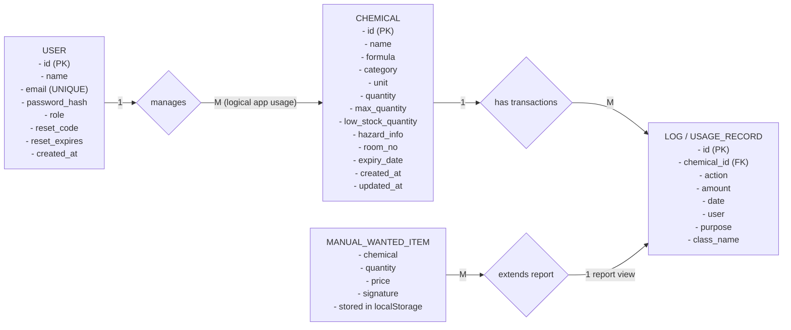
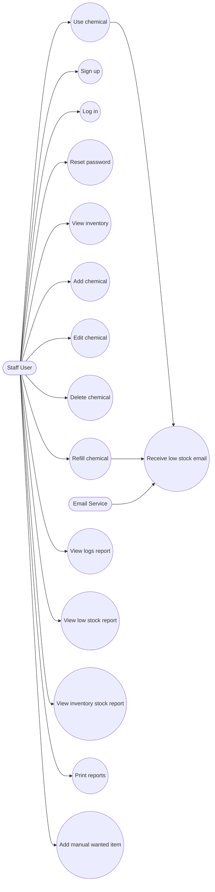
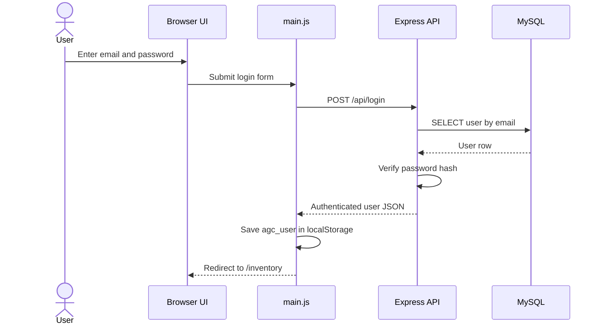
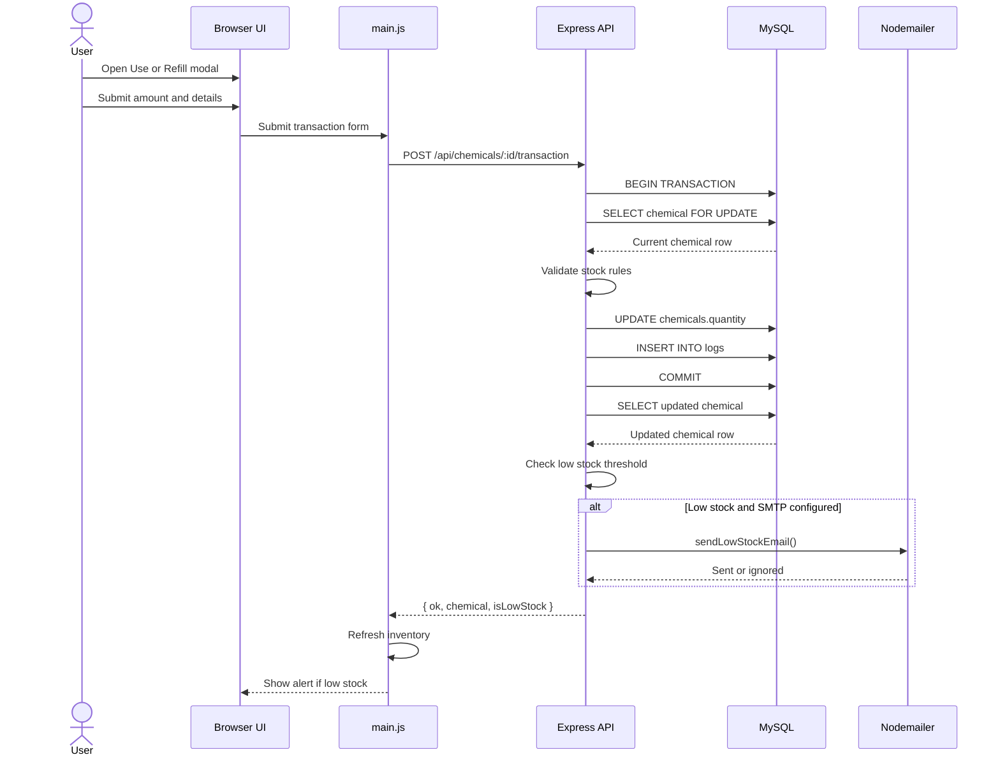
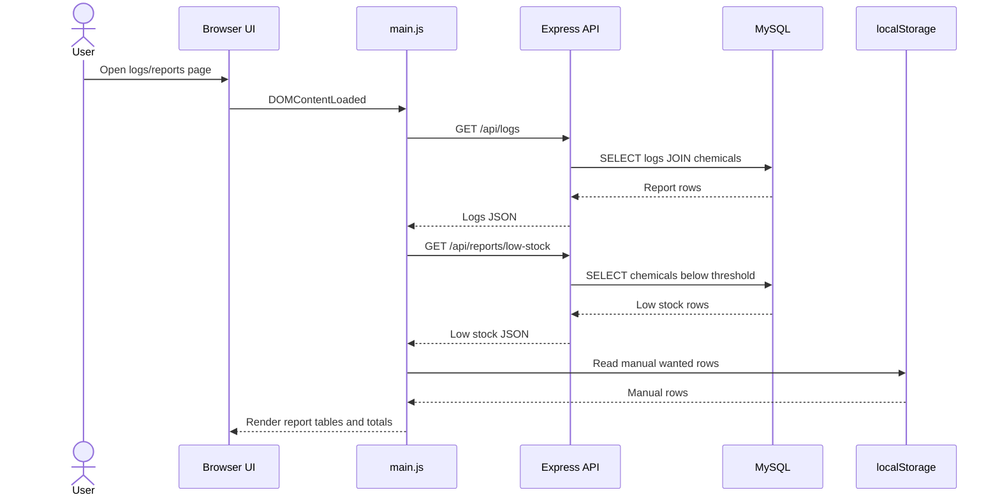
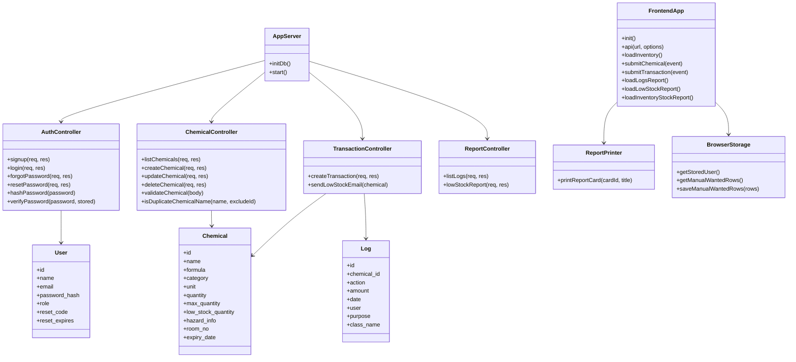
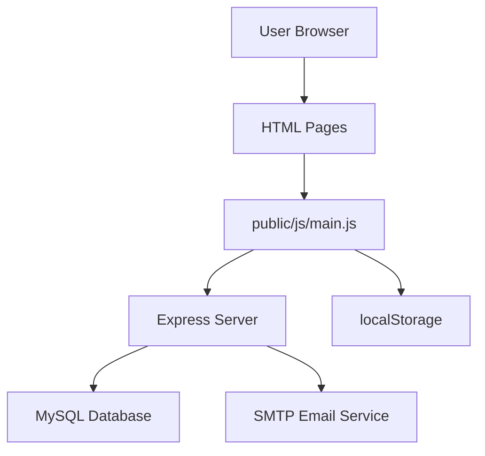

# AGC LAB.CO System Understanding

## Project summary

AGC LAB.CO is a chemical inventory management system built with:

- Node.js + Express backend
- MySQL database
- Plain HTML/CSS/JavaScript frontend
- Nodemailer for optional low-stock email alerts
- `localStorage` for browser-side session and manual wanted rows

The main business flow is:

1. A user signs up or logs in.
2. The user views the chemical inventory.
3. The user adds, edits, deletes, uses, or refills chemicals.
4. Each use/refill creates a log entry.
5. Low stock chemicals appear in reports and may trigger an email alert.

## Main modules

- `server.js`
  Backend server, database bootstrap, API routes, transaction handling, and low-stock alert logic.
- `public/js/main.js`
  Frontend page behavior, API calls, modal handling, filtering, reporting, printing, and `localStorage` use.
- `lab.sql`
  MySQL schema and sample data for `users`, `chemicals`, and `logs`.

## ER Diagram

This version is arranged more like the example image, using entity boxes plus relationship labels.

Notes:

- `logs.chemical_id` references `chemicals.id`.
- `users` is used for authentication, but `logs.user` stores a text name, not `users.id`.
- The database has 3 real tables: `users`, `chemicals`, and `logs`.
- Manual wanted items are report-only browser data kept in `localStorage`, not in MySQL.
- If you want strict database ER modeling, `USER -> CHEMICAL` is not a physical foreign-key relationship; it is a functional/system relationship only.

## Use Case Diagram

## Sequence Diagram: Login

## Sequence Diagram: Use / Refill Chemical

## Sequence Diagram: Load Reports

## Class Diagram

This project is not written with ES6 classes, so the class diagram below is a conceptual design diagram showing the main system objects and responsibilities.

## Simple system architecture

## Important observations

- Authentication is session-less on the server side; the frontend stores the logged-in user in `localStorage`.
- Authorization is minimal. A logged-in browser user can call inventory APIs, but there is no server-side session or token validation.
- `logs.user` is stored as plain text, so log history is not strongly linked to a real `users.id`.
- The transaction route is the most important business flow because it updates stock and creates log records in one database transaction.
- Low stock reporting combines database data with browser-only manual rows.
